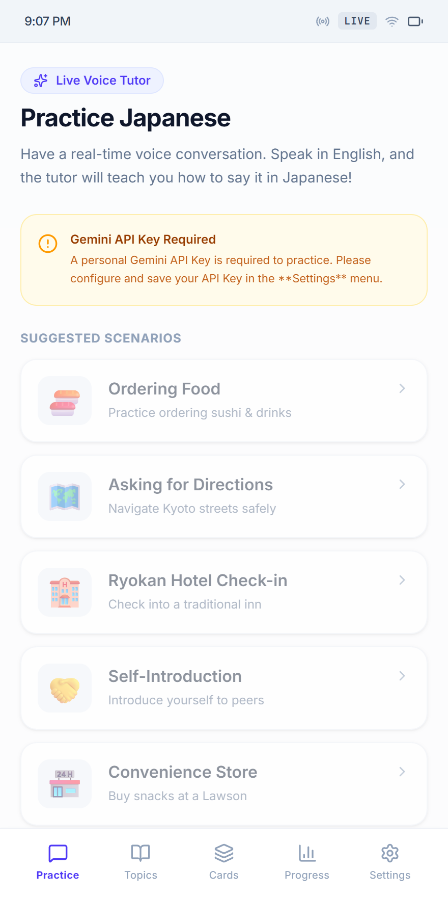
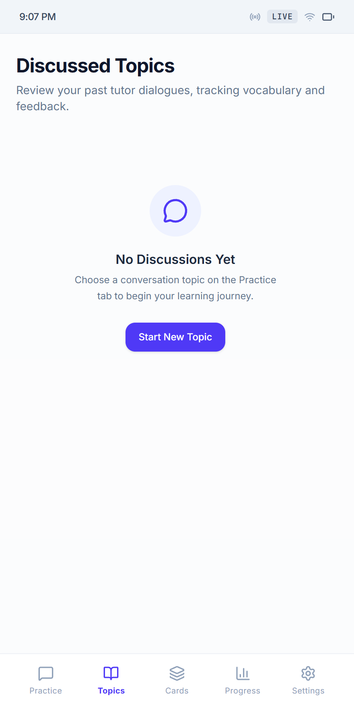
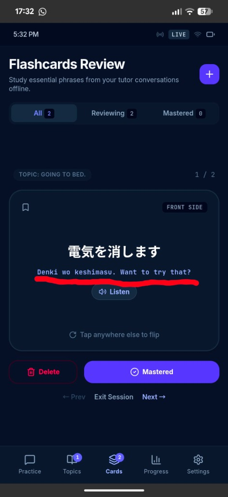
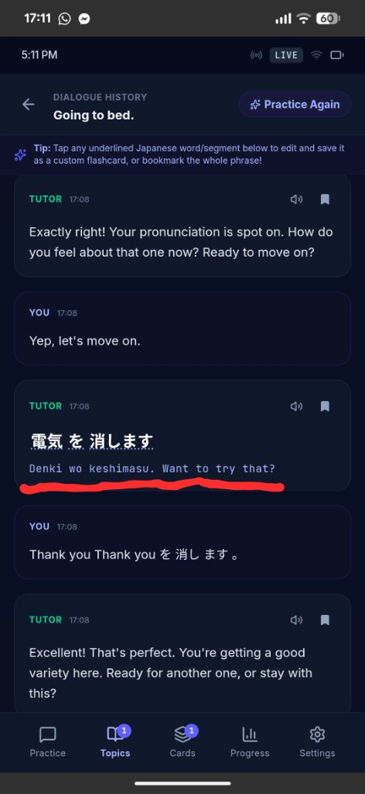
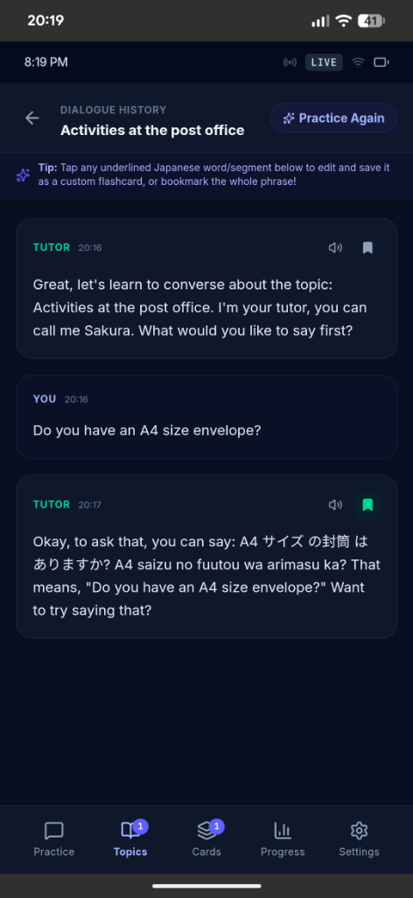

# 🌸 Nihongo Voice Tutor - User Manual & Operating Guide

Welcome to **Nihongo Voice Tutor (JP-Tutor)**! This document serves as your complete operating guide for setting up, practicing, and mastering Japanese using our multimodal AI voice tutor.

---

## 📌 Table of Contents
1. [Getting Started & Setup](#1-getting-started--setup)
2. [Live 1-on-1 Voice Lessons](#2-live-1-on-1-voice-lessons)
3. [Topics & Custom Scenarios](#3-topics--custom-scenarios)
4. [SRS Flashcards & Word Capture](#4-srs-flashcards--word-capture)
5. [Syncing Data Across Devices](#5-syncing-data-across-devices)
6. [Troubleshooting & Diagnostics](#6-troubleshooting--diagnostics)

---

## 1. 🚀 Getting Started & Setup

Nihongo Voice Tutor connects directly to Google AI Studio's Gemini Multimodal Live Audio API to provide high-speed, interactive Japanese voice lessons.

### Step-by-Step Setup

1. **Get a Gemini API Key**: Visit [Google AI Studio](https://aistudio.google.com/) and create a free API key (starts with `AIzaSy...`).
2. **Open Settings**: Tap the ⚙️ icon in the top header.
3. **Save API Key**: Paste your key into the **Gemini API Key** input box.
4. **Choose Voice**: Select your preferred tutor voice (`Aoede` or `Puck`).
5. **Save**: Click **Save Settings**.

---

## 2. 🎙️ Live 1-on-1 Voice Lessons

- Tap the large blue **Microphone Button** to begin your voice lesson.
- Speak out loud in English or Japanese!
  - *Example:* "How do I ask for the bill at a restaurant?"
- The tutor will reply in spoken Japanese:
  - *"You can say: お会計をお願いします (Okaikei wo onegai shimasu). That means 'Check, please.' Now you try saying it!"*
- The tutor will pause so you can practice repeating the phrase.

---

## 3. 🗂️ Topics & Custom Scenarios

Choose from a variety of predefined situations or enter your own custom prompt:
- ⛽ **Gas Station**: Refueling and payment.
- ☕ **Ordering Coffee**: Sizing and milk options.
- 🏨 **Ryokan Hotel Check-in**: Reservation and bath times.
- 🗺️ **Asking Directions**: Navigating train stations.

---

## 4. 🎴 SRS Flashcards & Word Capture

| Flashcards Practice | Detailed Card View |
|:---:|:---:|
|  |  |

- **Segmented Word Capture**: Tap any underlined Japanese word in the live transcript to create a card for that word.
- **Bookmark Sentences**: Click 🔖 next to any tutor statement to save the full sentence.
- **24kHz HD Audio**: Click **Listen** on any card to hear pronunciation synthesized by **Microsoft Edge Neural Speech (`ja-JP-NanamiNeural`)**.

---

## 5. 🔄 Syncing Data Across Devices

1. Go to **Settings** ➔ **Data Synchronization**.
2. Tap **Get Sync PIN** to get your unique 6-digit backup PIN.
3. Tap **Sync Up** to back up your flashcards to the encrypted server.
4. On your second device, enter your 6-digit PIN and tap **Sync Down** to restore.

---

## 6. 🛠️ Troubleshooting & Diagnostics

If you experience audio or connection issues:
- Tap the 💻 icon in the header to view client/server logs.
- Click **Email Dev** to automatically package your diagnostic logs into an email report.
